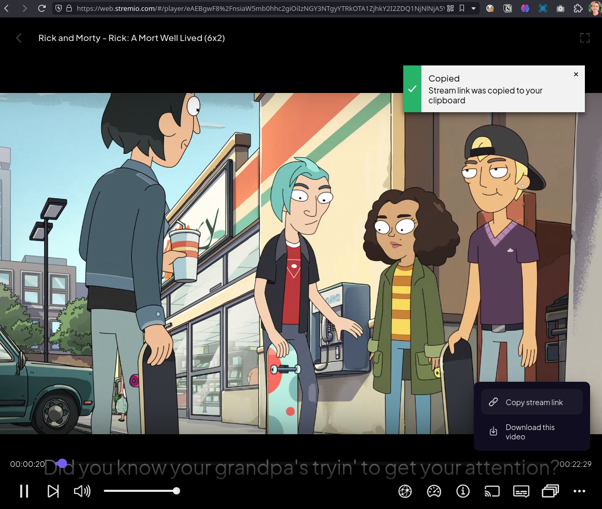
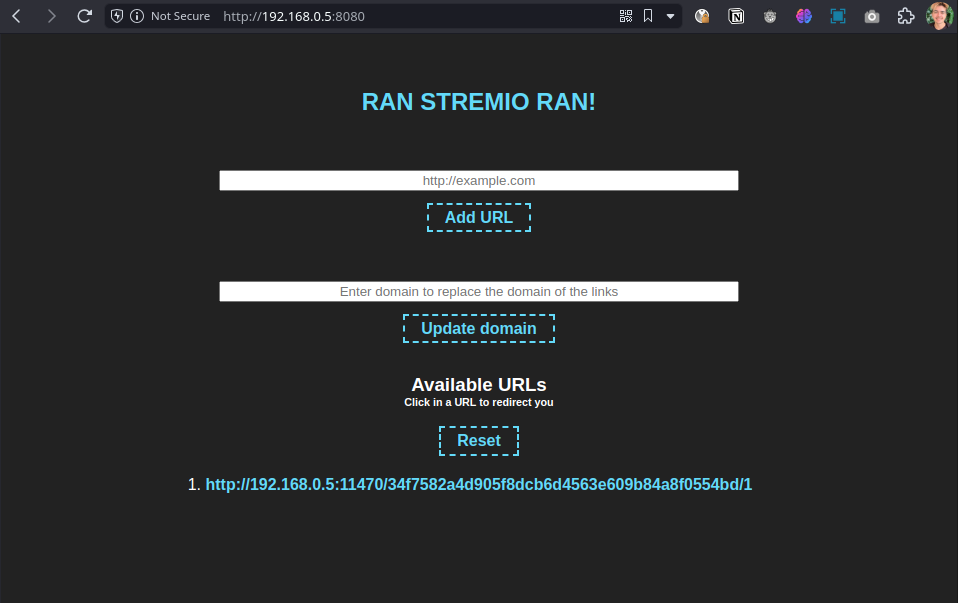

# RUN STREMIO RUN!!

## Goal

Make a Stremio server available on the user's machine and a page to make them connect to the server with 1 click.

## Overview

This simple web application allows users to dynamically add and redirect to URLs within a local network. It is built using Node.js with Express on the server-side and HTML with JavaScript on the client-side.

## Features

- **Dynamic URL Addition:** Users can add new URLs to the application, and the list dynamically updates without the need for page reloads.
  
- **URL Redirection:** Clicking on a listed URL redirects the user to the specified destination.

- **User Authentication (Optional):** User authentication can be enabled to secure certain functionalities.

## Getting Started

### Prerequisites

- Node.js and npm installed on your machine.

### Additional resources

- Install Stremio addons from https://stremio-addons.netlify.app
  > I recommend at least Torrentio
- Browser script [violentMonkey.user.js](docs/violentMonkey.user.js)

### Installation
#### Docker (recommended)

```bash
git clone https://github.com/andersonbosa/run-stremio-run.git
cd url-redirection-app
make up
``` 

#### Manually
1. Clone the repository:

```bash
git clone https://github.com/andersonbosa/run-stremio-run.git
cd url-redirection-app
```

2. Install dependencies:

```bash
npm install
```

3. Start the server:

```bash
npm start
```

The application will be available at http://localhost:8080 by default.

## Usage

### Web page

1. Open the application in a web browser.
2. Add URLs using the "Add URL" form.
3. Click on a listed URL to redirect to the specified destination.
4. Optionally, enter a domain to replace links dynamically.

### Browser script (Made to be used with ViolentMonkey)

When you click the "Copy Stream Link" button (vide image 1) the script will make the 
request for API store the URL and displaying on the homepage (default http://localhost:8080).
> Image 1: Copy stream link from https://web.stremio.com
> 

> Image 2: URL stored via API
>

### Configuration
Authentication: User authentication can be enabled or disabled by modifying the SHOULD_AUTHENTICATE variable in src/index.js.

## Contributing
Contributions are welcome! Feel free to open issues or submit pull requests.

## License
This project is licensed under the MIT License.

